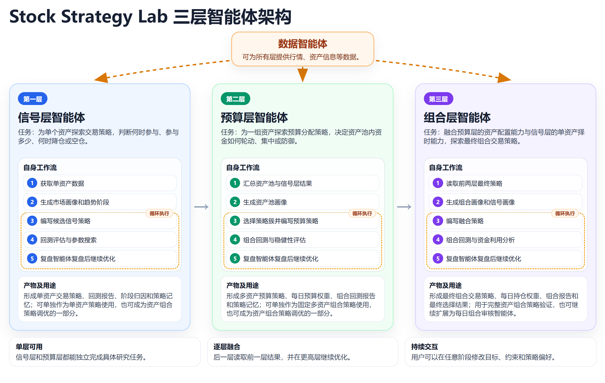
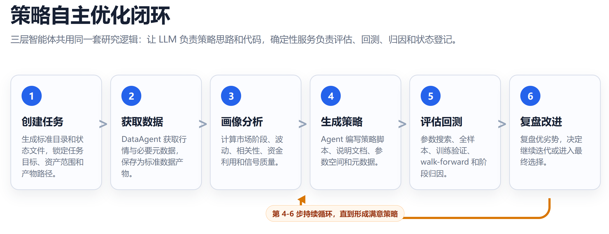
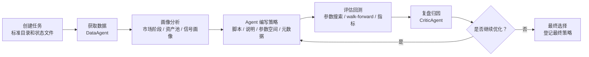
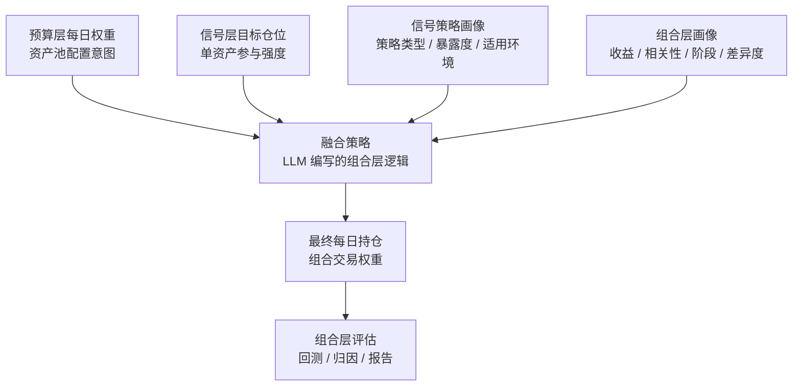

# Stock Strategy Lab

一个面向 A 股、ETF、指数研究的多智能体量化策略工作台。

Stock Strategy Lab 的目标不是提供一个固定策略，而是构建一套可以长期交互、反复运行、持续沉淀的多智能体研究系统。项目以三层智能体为核心：信号层智能体探索单资产交易策略，预算层智能体探索资产池配置策略，组合层智能体融合前两层并继续探索最终组合策略。三层可以串联形成完整投资研究流水线，也可以单独使用，例如只让信号层为某个资产寻找交易策略，或只让预算层为一组资产寻找轮动配置方案。

> 重要说明：本项目仅用于量化研究、策略实验和工程学习，不构成任何投资建议。回测结果不代表未来收益。

## 项目亮点

- **三层多智能体策略体系**：信号层、预算层、组合层各自独立成环，也可以逐层融合。单层可以完成特定任务，三层组合可以形成完整策略研究链路。
- **每层都是自主迭代闭环**：每层都遵循“策略编写 -> 回测评估 -> 复盘归因 -> 再优化”的循环，直到达到停止条件或形成最终方案。
- **用户可随时介入调整**：运行过程中可以直接告诉智能体改变偏好、限制风险、调整策略方向、补充数据范围、继续优化某个版本或回退到某个思路。
- **会话持久化与切换**：交互式 CLI 支持会话保存、会话列表、恢复历史会话，适合长周期研究任务。
- **记忆管理**：智能体会维护任务记忆，记录阶段、尝试过的策略、评估结果、复盘要点和下一步方向。
- **Agent 驱动策略探索**：使用 DeepAgents / LangChain 框架，发挥框架优势，让 LLM 读写文件、执行命令、调用工具、维护待办并完成复杂任务。
- **多方式参数搜索与稳健性验证**：回测评估阶段支持 grid、random、遗传算法 GA 等参数搜索方式，并结合 train/validation、walk-forward 等流程检验策略稳健性。
- **标准化实验产物**：每次任务都有独立运行目录、状态文件、策略文件、指标、图表、报告和最终选择结果。
- **可扩展策略框架**：策略库、策略框架和 skill 文档都可以修改。你可以扩展机器学习、缠论、因子模型、统计套利、强化学习、事件驱动等探索范围，丰富策略空间。

## 总体架构





## 三层策略体系

### 1. 信号层智能体：单资产策略探索

信号层智能体负责回答：**某一个资产自己应该什么时候买、买多少、什么时候降仓或空仓。**

它的核心产物包括：可执行策略脚本、策略说明、参数搜索空间、策略元数据、智能体运行记忆、回测指标、复盘报告和图表。

信号层不是简单套用 MA、RSI、MACD 等传统模板，而是让 LLM 在一个可扩展策略框架内自由组合。当前策略库内置 30+ 类信号构件和策略思路，主要覆盖趋势动量、通道突破、均值回归、波动率状态、量价过滤、多周期确认、防御降仓、状态切换、仓位映射和交易纪律等方向。信号层的策略范围并不是固定的，你可以修改信号层策略编写 skill 中的策略库和参考框架，扩大智能体可探索并组合使用的策略、以及完整的投资框架，比如引入强化学习等。对应文件位于 `src/strategy_lab/skills/signal_agent/strategy-authoring/SKILL.md`，更详细的策略库参考在 `src/strategy_lab/skills/signal_agent/strategy-authoring/references/signal_strategy_library.md`。当前基础框架强调不同市场状态和不同周期下的 Alpha 切换：

```text
SignalStrategy =
    RegimeSwitchingAlpha     不同市场状态下的 Alpha 切换
  + MultiTimeframeAlpha      多周期信号确认
  + Filters                  辅助过滤器
  + ExitPolicy               出场与风控
  + PositionMapper           仓位映射
  + StateRules               状态与交易纪律
```

信号层智能体工作流：

```text
创建信号层任务
-> 获取单资产数据
-> 生成市场画像和趋势阶段
-> 编写多个候选策略
-> 批量或单策略评估
-> 复盘表现和失败阶段
-> 修改 Alpha / Filter / Exit / Position / StateRules
-> 反复迭代
-> 选择最终单资产策略
```

### 2. 预算层智能体：资产池预算策略探索

预算层智能体负责回答：**在一组资产之间，资金预算应该如何分配。**

它站在资产池角度考虑趋势、动量、波动、相关性、分散度、风险预算、再平衡节奏和用户偏好。它可以单独作为资产配置智能体使用，也可以作为组合层的上游输入。

预算层的核心产物包括：结构化预算策略配置、策略说明、参数搜索空间、策略元数据、智能体运行记忆、每日预算权重、回测指标、阶段归因和图表。

预算层策略结构：

```text
BudgetPolicy =
    UniverseGate        候选资产准入
  + AssetScorer         资产打分
  + AllocationEngine    预算分配
  + RiskOverlay         风险覆盖
  + RebalanceScheduler  调仓节奏
  + ConstraintProjector 约束投影
  + Diagnostics         诊断输出
```

当前预算层策略库包含多个策略簇。智能体通常先读取资产池画像，判断资产池更接近趋势轮动、低波防御、均衡配置、集中进攻、风险预算、相关性约束等哪类场景；再结合用户偏好，例如更看重收益、夏普、最大回撤、换手率或资金利用率，缩小候选策略簇；随后生成候选预算策略并回测评估。必要时可以跨策略簇组合，而不是只能从一个模板里选。

预算层策略库同样可以扩展。你可以修改预算层策略编写 skill 中的策略库，增加新的资产准入规则、打分因子、分配算法、风险约束、再平衡规则或完整预算框架。对应文件位于 `src/strategy_lab/skills/budget_agent/budget-policy-authoring/SKILL.md`，更详细的策略库参考在 `src/strategy_lab/skills/budget_agent/budget-policy-authoring/references/budget_policy_library.md`。

预算层智能体工作流：

```text
创建预算层任务
-> 汇总信号层最终结果或用户指定资产池
-> 生成多资产行情面板
-> 生成资产池画像
-> 根据画像和用户偏好选择策略簇
-> 编写一个或多个预算策略
-> 参数搜索和组合回测
-> 复盘阶段表现、持仓、换手和风险暴露
-> 调整评分器、分配引擎、风险覆盖和调仓节奏
-> 反复迭代
-> 选择最终预算策略
```

### 3. 组合层智能体：信号层与预算层融合

组合层负责回答：**如何把预算层的资产池配置能力和信号层的单资产择时能力融合成最终可执行的组合交易策略。**

预算层更偏“择券、分配、风险预算”，信号层更偏“择时、参与强度、单资产风险控制”。组合层的任务不是机械相乘，而是学习两层之间如何互补、修正和再分配。它可以
-用信号强度修正预算权重；
-用预算约束限制信号选择；
-把预算层未充分使用的现金再分配给信号更强的资产；
-在信号普遍偏弱时提高现金比例；
-根据市场阶段、资产类别、信号策略类型、回撤状态和资金利用率设计不同融合逻辑...
总之，智能体将基于用户的偏好和信号层、预算层结果探索最佳组合策略，同时，在有必要时提出前面两层的修复意见，从而形成项目整体的闭环。

组合层的核心产物包括：融合策略脚本、策略说明、参数搜索空间、策略元数据、每日最终持仓、组合层回测指标、复盘报告和可选的每日组合智能体提示词。

组合层智能体工作流：

```text
创建组合层任务
-> 复制预算层最终策略和各资产信号层最终策略快照
-> 生成组合层市场画像
-> 生成信号层策略画像
-> 编写第一版融合策略
-> 组合回测和阶段归因
-> 复盘预算、信号、融合逻辑和资金利用率
-> 修改融合策略
-> 反复迭代
-> 选择最终组合层策略
```

## Hermes Agent / DeepAgents 式交互能力

本项目不是一次性脚本执行器，而是更接近 Hermes Agent 概念的可交互研究助手。每个主智能体都可以在终端里持续工作，读取文件、写入文件、搜索目录、执行命令、维护待办事项、调用子智能体和服务，并在长任务中保存状态。

能力包括：

- **终端交互**：通过 CLI 与主智能体持续对话，类似让一个研究助手在项目目录里工作。
- **会话持久化**：可以列出、切换和恢复历史会话，继续上次未完成的任务。
- **任务记忆**：智能体会维护当前任务的记忆文件，记录尝试、结论、失败点和下一步。
- **复杂任务拆解**：DeepAgents 的待办管理能力可以帮助长流程任务保持稳定。
- **文件级操作**：智能体可以阅读策略说明、修改策略脚本、查看报告、整理产物。
- **上下文管理**：长会话中可以依赖模型和框架的上下文压缩机制，减少长任务中断风险。
- **多智能体封装**：复盘智能体、数据智能体等被封装为独立能力，由各层主智能体按需调用，不让主智能体承担所有上下文。
- **自我调整空间**：用户可以要求智能体修改记忆、偏好、策略库或 skill 文档，让后续探索更符合自己的投资风格。

## 策略闭环



## 组合层数据流



## 安装

### 环境要求

- Python 3.11+
- Windows / macOS / Linux 均可运行基础功能
- MiniQMT / xtquant 数据能力主要面向本地 Windows QMT 环境
- 可选：DeepSeek、Moonshot/Kimi 等 OpenAI-compatible LLM API

### 安装命令

```powershell
cd D:\path\to\stock_strategy_lab
python -m venv .venv
.\.venv\Scripts\activate
python -m pip install --upgrade pip
pip install -e ".[quant,agents,data,dev]"
```

如果只想先安装基础 CLI：

```powershell
pip install -e .
```

## 配置

复制环境变量模板：

```powershell
copy .env.example .env
```

然后在 `.env` 中填写自己的 API Key 和本地数据源配置。

关键配置项：

```text
DEEPSEEK_API_KEY=
DEEPSEEK_BASE_URL=https://api.deepseek.com
DEEPSEEK_MODEL=deepseek-v4-pro

MOONSHOT_API_KEY=
MOONSHOT_BASE_URL=https://api.moonshot.cn/v1
MOONSHOT_MODEL=kimi-k2.6

QMT_USERDATA=
QMT_ACCOUNT_ID=
```

不同智能体可以通过下列变量独立切换模型：

```text
SIGNAL_AGENT_MODEL=
BUDGET_AGENT_MODEL=
PORTFOLIO_AGENT_MODEL=
CRITIC_AGENT_MODEL=
BUDGET_CRITIC_AGENT_MODEL=
PORTFOLIO_CRITIC_AGENT_MODEL=
```

项目默认配置在 [configs](configs/) 目录。

## 快速开始

检查配置：

```powershell
python -m strategy_lab.cli config
```

初始化 artifacts 目录：

```powershell
python -m strategy_lab.cli init
```

查看帮助：

```powershell
python -m strategy_lab.cli --help
python -m strategy_lab.cli signal --help
python -m strategy_lab.cli budget --help
python -m strategy_lab.cli portfolio --help
```

## 交互式智能体示例

### SignalAgent

```powershell
python -m strategy_lab.cli signal chat
```

示例任务：

```text
请为 512880.SH 生成一个单资产交易策略，数据范围使用过去 10 年日线数据，目标优先提升夏普比率，同时控制最大回撤。运行中如果发现策略过于保守，可以主动调整 Alpha 或仓位映射。
```

### BudgetAgent

```powershell
python -m strategy_lab.cli budget chat
```

示例任务：

```text
请读取这些信号层结果目录，基于资产池训练一个预算层轮动策略。我的偏好是控制最大回撤，同时不要让资金长期闲置。
```

### PortfolioAgent

```powershell
python -m strategy_lab.cli portfolio chat
```

示例任务：

```text
请基于这个预算层最终结果目录创建组合层任务，分析信号层策略画像，探索预算层和信号层如何融合，并持续回测优化，最终选择最优组合层方案。
```

## 交互式 `/` 命令

进入任意主智能体的 `chat` 模式后，可以使用 `/` 命令管理会话、任务状态和当前 run。底层 Typer 命令仍然可以通过 `python -m strategy_lab.cli --help`、`python -m strategy_lab.cli signal --help` 等方式查看；日常交互时更常用的是下面这些 `/` 命令。

三层主智能体的启动命令：

```powershell
python -m strategy_lab.cli signal chat
python -m strategy_lab.cli budget chat
python -m strategy_lab.cli portfolio chat
```

通用 `/` 命令：

| 命令 | 适用智能体 | 作用 |
| --- | --- | --- |
| `/help` | Signal / Budget / Portfolio | 查看当前交互终端支持的命令 |
| `/exit` | Signal / Budget / Portfolio | 退出当前交互终端 |
| `/quit` | Signal / Budget / Portfolio | `/exit` 的别名 |
| `/q` | Signal / Budget / Portfolio | `/exit` 的短别名 |
| `/new` | Signal / Budget / Portfolio | 创建新的持久化会话 |
| `/reset` | Signal / Budget / Portfolio | 创建新会话，作为 `/new` 的别名 |
| `/sessions` | Signal / Budget / Portfolio | 列出历史对话会话 |
| `/resume THREAD_ID` | Signal / Budget / Portfolio | 恢复指定历史会话 |
| `/clear` | Signal / Budget / Portfolio | 清屏 |
| `/runs` | Signal / Budget / Portfolio | 列出最近的该层 run |
| `/load RUN_ID` | Signal / Budget / Portfolio | 载入某个 run，使后续对话围绕该任务继续 |
| `/status` | Signal / Budget / Portfolio | 查看当前已加载 run 的状态摘要 |
| `/memory` | Signal / Budget / Portfolio | 查看当前 run 的智能体记忆文件，如果存在 |
| `/pause` | Signal / Budget / Portfolio | 表示希望暂停当前轮次边界；正在执行的长工具通常不会被强行中断 |

典型交互方式：

```text
> /sessions
> /resume signal-chat-20260512-001122
> /runs
> /load signal_512880_SH_20260512_000656
> /status
> /memory
> 请继续优化上一轮策略，但这次更重视最大回撤和资金利用率。
```

会话恢复也可以在启动时直接指定：

```powershell
python -m strategy_lab.cli signal chat --resume-latest
python -m strategy_lab.cli budget chat --thread-id budget-chat-xxxx
python -m strategy_lab.cli portfolio chat --thread-id portfolio-chat-xxxx
```

## 项目目录

```text
stock_strategy_lab/
├── configs/                 # 项目配置
├── docs/
│   ├── assets/              # README 图片截图输出目录
│   └── diagrams/            # HTML 图源
├── src/strategy_lab/
│   ├── agents/              # 主智能体和复盘智能体
│   ├── services/            # 回测、画像、参数搜索、状态管理等确定性服务
│   ├── signals/             # 信号层基础接口和基线策略
│   ├── skills/              # DeepAgents skill 文档和参考文件
│   ├── tools/               # Agent 间调用工具
│   ├── config/              # 配置加载
│   └── cli.py               # Typer CLI 入口
├── artifacts/               # 本地运行产物，默认不提交
├── .env.example             # 环境变量模板
├── pyproject.toml
└── README.md
```

## Artifacts 说明

`artifacts/` 是运行时目录，默认被 `.gitignore` 忽略。

常见结构：

```text
artifacts/
├── signal_runs/
│   └── signal_xxx/
│       ├── run_state
│       ├── attempts/
│       ├── reports/
│       └── final/
├── budget_runs/
│   └── budget_xxx/
│       ├── budget_run_state
│       ├── policies/
│       ├── searches/
│       └── final/
└── portfolio_runs/
    └── portfolio_xxx/
        ├── portfolio_run_state
        ├── source_artifacts/
        ├── versions/
        └── final/
```

## 核心 Agent

| Agent | 所属层级 | 类型 | 作用 |
| --- | --- | --- | --- |
| DataAgent | 数据层 | 支撑智能体 | 获取、清洗和保存行情及相关数据，供其他层调用 |
| SignalAgent | 信号层 | 主智能体 | 探索单资产交易策略，负责生成、评估、复盘后的再优化决策 |
| CriticAgent | 信号层 | 复盘子智能体 | 对单资产策略或多策略候选进行复盘和横向比较 |
| BudgetAgent | 预算层 | 主智能体 | 探索资产池预算策略，负责资产画像、策略生成、评估和最终选择 |
| BudgetCriticAgent | 预算层 | 复盘子智能体 | 对预算策略进行单策略复盘或多策略横向比较 |
| PortfolioAgent | 组合层 | 主智能体 | 融合信号层和预算层，探索最终组合交易策略 |
| PortfolioCriticAgent | 组合层 | 复盘子智能体 | 复盘组合层表现，分析预算、信号、融合逻辑和资金利用率 |

## Skills 说明

`src/strategy_lab/skills/` 中按照智能体划分出专属或通用 skill 。

| Skill | 所属层级 | 作用 |
| --- | --- | --- |
| `data_agent/akshare` | 数据层 | 指导 DataAgent 使用 AKShare 获取公开数据 |
| `data_agent/miniqmt` | 数据层 | 指导 DataAgent 使用 MiniQMT / xtquant 获取本地行情数据 |
| `common/image-review` | 通用能力 | 图片理解能力，可供需要看图的智能体调用 |
| `signal_agent/signal-run` | 信号层 | 创建或读取信号层任务状态 |
| `signal_agent/data-split` | 信号层 | 生成单资产训练、验证和 walk-forward 数据切分 |
| `signal_agent/market-profile` | 信号层 | 生成单资产市场画像和趋势阶段 |
| `signal_agent/strategy-authoring` | 信号层 | 指导 SignalAgent 编写单资产策略 |
| `signal_agent/attempt-evaluation` | 信号层 | 一键完成策略保存、参数搜索、回测、摘要和阶段归因 |
| `critic_agent/single-attempt-review` | 信号层复盘 | 复盘单个信号层策略 attempt |
| `critic_agent/multi-attempt-comparison` | 信号层复盘 | 横向比较多个信号层策略 attempt |
| `budget_agent/budget-run` | 预算层 | 创建预算层任务并汇总信号层最终结果 |
| `budget_agent/budget-data-panel` | 预算层 | 生成多资产行情面板和收益矩阵 |
| `budget_agent/budget-data-split` | 预算层 | 生成预算层训练、验证和 walk-forward 数据切分 |
| `budget_agent/budget-profile` | 预算层 | 生成资产池画像和元数据摘要 |
| `budget_agent/budget-policy-authoring` | 预算层 | 指导 BudgetAgent 编写预算策略 |
| `budget_agent/budget-policy-evaluation` | 预算层 | 一键评估单个或多个预算策略 |
| `budget_agent/budget-final-selection` | 预算层 | 登记最终预算层策略 |
| `budget_critic_agent/single-policy-review` | 预算层复盘 | 复盘单个预算策略 |
| `budget_critic_agent/multi-policy-comparison` | 预算层复盘 | 横向比较多个预算策略 |
| `portfolio_agent/portfolio-run` | 组合层 | 创建组合层任务并复制预算层、信号层源产物 |
| `portfolio_agent/portfolio-data-split` | 组合层 | 生成组合层数据切分 |
| `portfolio_agent/portfolio-profile` | 组合层 | 生成组合层市场画像、预算与信号差异信息 |
| `portfolio_agent/portfolio-signal-profile` | 组合层 | 生成每个资产信号策略画像 |
| `portfolio_agent/portfolio-policy-authoring` | 组合层 | 指导 PortfolioAgent 编写融合策略 |
| `portfolio_agent/portfolio-fusion-version` | 组合层 | 初始化组合层策略版本和源产物快照 |
| `portfolio_agent/portfolio-evaluation` | 组合层 | 执行组合层策略评估和回测 |
| `portfolio_agent/portfolio-final-selection` | 组合层 | 登记最终组合层策略并复制最终产物 |
| `portfolio_critic_agent/portfolio-review` | 组合层复盘 | 复盘组合层策略表现和优化方向 |

## 数据源

当前支持：

- MiniQMT / xtquant
- AKShare

数据获取能力集中由 DataAgent 和相关 skill 管理。策略层、预算层和组合层通常只消费已经标准化后的数据文件。

## 回测与评估

回测评估不仅是单次跑净值曲线，还包括参数搜索和稳健性验证。当前关键词包括：grid search、random search、遗传算法 GA、train/validation 切分、walk-forward、阶段归因、基准对比和 QuantStats 报告。

项目会生成多类评估产物：

- 净值曲线
- 订单记录
- 每日信号或每日权重
- 指标文件
- 自然语言报告
- QuantStats HTML 报告
- 策略与基准对比图
- 阶段归因
- walk-forward 稳健性结果

不同层级的评分逻辑略有差异，但都倾向于综合考虑：

- 夏普比率
- 年化收益
- 最大回撤
- Calmar
- 交易活跃度
- 稳健性
- 资金利用率

## 联系方式

联系邮箱：lizheng202601@163.com
